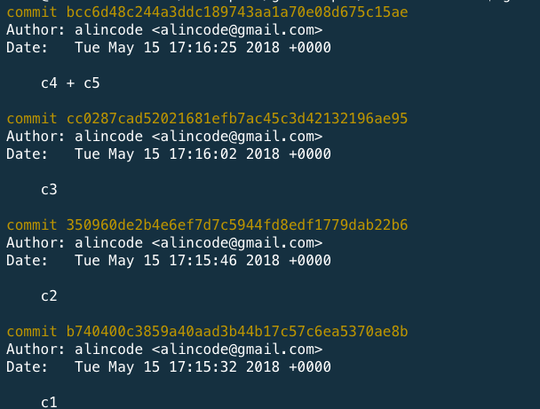
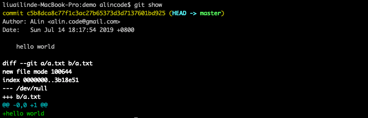

# log / show 指令





### 使用情境

* 查看送交內容 / 更變

### SHA-1

是一種雜湊演算法，計算之後的結果為 40 個 16 進位的數字呈現，只要有相同的輸入值，就會有相同的輸出值。Git 的編號就是以此演算法算出。

### 常用指令範例

| 範例                                             | 說明                           |
|-------------------------------------------------|--------------------------------|
| git show README.md                              | 查看 README.md 檔案的內容變動紀錄  |
| git log --oneline                               | 查看 commit 歷史紀錄             |
| git log --oneline --grep="fixed"                | 查看 commit 訊息裡面包含有 fixed 的紀錄    |
| git log --oneline -S "hello world"              | 查看內容有包含 hello world 的紀錄  |
| git log -p hello.js                             | 查看這個檔案每次的 commit 做了什麼修改 |
| git log -2                                      | 查看最後兩筆 commit 歷史紀錄       |
| git log master                                  |                                |
| git log --author="alincode"                     | 只查看特定人的送交紀錄             |
| git log --follow README.md                      | 列出包含該檔案變動的提交(包含改名前) |
| git log --graph --oneline --all --decorate      | 顯示所有分之並圖形化               |
| git log --since="1 weeks ago"                   | 一週內的 log                     |

* –graph：排列出 commit 節點的演進圖
* –oneline：最精簡的方式顯示．
* –all：顯示所有分支的commit紀錄。
* –decorate：表示要標示分支的名稱。

<!-- git log \^[commitA] # A 之後的提交(不列出 A 之前的提交，不含 A) -->
git log -[num] # 最近[num]筆的提交紀錄

### 語法結構

```
usage: git log [<options>] [<revision-range>] [[--] <path>...]
   or: git show [<options>] <object>...

    -q, --quiet           suppress diff output
    --source              show source
    --use-mailmap         Use mail map file
    --decorate-refs <pattern>
                          only decorate refs that match <pattern>
    --decorate-refs-exclude <pattern>
                          do not decorate refs that match <pattern>
    --decorate[=...]      decorate options
    -L <n,m:file>         Process line range n,m in file, counting from 1
```