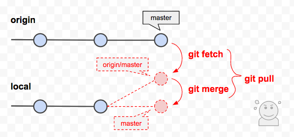

# git pull 指令

拉回遠端 repo 最新版送交歷史紀錄，並 merge 到本地端 repo

git pull = git fetch + git merge



### 常用範例

| 範例       | 說明               |
|----------|------------------|
| git pull | 將遠端的資料更新到本地端，並合併 |

### 語法結構

```
usage: git pull [<options>] [<repository> [<refspec>...]]

    -v, --verbose         be more verbose
    -q, --quiet           be more quiet
    --progress            force progress reporting

Options related to merging
    -r, --rebase[=<false|true|preserve>]
                          incorporate changes by rebasing rather than merging
    -n                    do not show a diffstat at the end of the merge
    --stat                show a diffstat at the end of the merge
    --log[=<n>]           add (at most <n>) entries from shortlog to merge commit message
    --squash              create a single commit instead of doing a merge
    --commit              perform a commit if the merge succeeds (default)
    --edit                edit message before committing
    --ff                  allow fast-forward
    --ff-only             abort if fast-forward is not possible
    --verify-signatures   verify that the named commit has a valid GPG signature
    -s, --strategy <strategy>
                          merge strategy to use
    -X, --strategy-option <option=value>
                          option for selected merge strategy
    -S, --gpg-sign[=<key-id>]
                          GPG sign commit

Options related to fetching
    --all                 fetch from all remotes
    -a, --append          append to .git/FETCH_HEAD instead of overwriting
    --upload-pack <path>  path to upload pack on remote end
    -f, --force           force overwrite of local branch
    -t, --tags            fetch all tags and associated objects
    -p, --prune           prune remote-tracking branches no longer on remote
    --recurse-submodules[=<on-demand>]
                          control recursive fetching of submodules
    --dry-run             dry run
    -k, --keep            keep downloaded pack
    --depth <depth>       deepen history of shallow clone
    --unshallow           convert to a complete repository
    --update-shallow      accept refs that update .git/shallow
    --refmap <refmap>     specify fetch refmap
```
