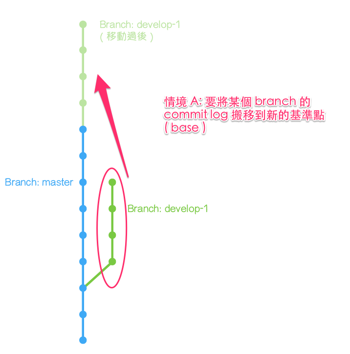

# git rebase 指令

**注意事項：只能用在未發佈的送交紀錄**

* 重新定位 (整形？拉皮？)
* 修改內容的歷史記錄會接在要合併的分支後面，合併後的歷史記錄會比較清楚簡單，但是會比使用 merge 更容易發生衝突。

### 使用情境

* 重新指定送交的基礎位置
* 將歷史紀錄進行重新排序、編輯、移除、壓縮、拆散送交

### 優點

可以不產生分支線和額外的 merge commit

### 缺點

* 等於改變提交記錄，僅適合修改還沒發佈的本機端送交紀錄
* 移動的commit若屬於多個分支，則每個分支都要重新指定位置。
* 經常無法自動合併成功的情況，一直得手動排除衝突，過度追求線圖的清晰，反而失去 Git 的部分優點。

```
🤔 選擇用 merge 還是 rebase? 需要保留樹狀記錄就用 merge，反之則用 rebase。
```

### 常用範例

| 範例                                                        | 說明              |
|-----------------------------------------------------------|--------------------|
| git rebase master                                         |                    |
| git rebase –continue                                      | 解決衝突後，繼續rebase |
| git rebase –abort                                         | 取消 rebase          |
| git rebase -skip                                          | 忽略 rebase 的 commit |
| git rebase -i HEAD^^                                      | 互動模式 rebase      |
| git rebase --onto <new base-commit> <current base-commit> | 指定要從哪裡開始      |

* –continue：執行rebase 指令後出現衝突的情況，而且我們己經編輯好發生衝突的文件，接著就可以執行 `git add` 指令， 把新的修改內容加入 Git 索引中，最後再執行這個指令，完成rebase的操作。
* –abort：如果執行 rebase 指令後出現衝突的情況，可以使用這個指令取消 rebase 的操作。 Git repo 會恢復到還沒有執行 rebase 之前的狀態。
* -skip：忽略一個原本要rebase的commit



### 互動模式

```
# Commands:
# p, pick = use commit
# r, reword = use commit, but edit the commit message
# e, edit = use commit, but stop for amending
# s, squash = use commit, but meld into previous commit
# f, fixup = like "squash", but discard this commit's log message
# x, exec = run command (the rest of the line) using shell
# d, drop = remove commit
```
### 語法結構

```
usage: git rebase [-i] [options] [--exec <cmd>] [--onto <newbase>] [<upstream>] [<branch>]
   or: git rebase [-i] [options] [--exec <cmd>] [--onto <newbase>] --root [<branch>]
   or: git-rebase --continue | --abort | --skip | --edit-todo

Available options are
    -v, --verbose         display a diffstat of what changed upstream
    -q, --quiet           be quiet. implies --no-stat
    --autostash           automatically stash/stash pop before and after
    --fork-point          use 'merge-base --fork-point' to refine upstream
    --onto ...            rebase onto given branch instead of upstream
    -p, --preserve-merges
                          try to recreate merges instead of ignoring them
    -s, --strategy ...    use the given merge strategy
    --no-ff               cherry-pick all commits, even if unchanged
    -m, --merge           use merging strategies to rebase
    -i, --interactive     let the user edit the list of commits to rebase
    -x, --exec ...        add exec lines after each commit of the editable list
    -k, --keep-empty         preserve empty commits during rebase
    -f, --force-rebase    force rebase even if branch is up to date
    -X, --strategy-option ...
                          pass the argument through to the merge strategy
    --stat                display a diffstat of what changed upstream
    -n, --no-stat         do not show diffstat of what changed upstream
    --verify              allow pre-rebase hook to run
    --rerere-autoupdate   allow rerere to update index with resolved conflicts
    --root                rebase all reachable commits up to the root(s)
    --autosquash         move commits that begin with squash
                          move commits that begin with squash!/fixup! under -i
    --committer-date-is-author-date
                          passed to 'git am'
    --ignore-date         passed to 'git am'
    --whitespace ...      passed to 'git apply'
    --ignore-whitespace   passed to 'git apply'
    -C ...                passed to 'git apply'
    -S, --gpg-sign[=...]  GPG-sign commits

Actions:
    --continue            continue
    --abort               abort and check out the original branch
    --skip                skip current patch and continue
    --edit-todo           edit the todo list during an interactive rebase
```