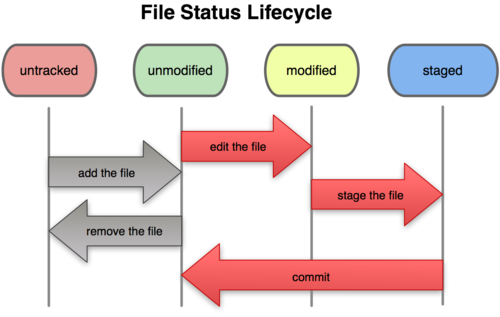

# git reset 指令

**注意事項：只能用在未發佈的送交紀錄**

reset(重新指向)，具有三種模式：

* --sort: 重新指向到還沒送交之前的狀態，但已被加入 index。
* --mixed: 預設的模式，重新指向到還沒加入 index 之前的狀態，但實際上的檔案修改還存在。
* --hard: 把暫存區和工作目錄的檔案都丟掉。(注意：檔案會消失)

### 使用情境

* 將新增並已加入索引的檔案，還原到沒加入索引之前。
* 重新指向到過去某一個狀態，在重新送交。
* 強制清除某一個狀態的修改的內容

### 常用範例

| 範例                    | 說明            |
|------------------------|-----------------|
| git reset HEAD^        |                 |
| git reset --sort HEAD^ |                 |
| git reset –-hard       | 回復到沒修改的狀態 |



### 練習題：將原本已經加入索引的檔案，從索引中移出。

```
$ git status
On branch master
Changes not staged for commit:
  (use "git add <file>..." to update what will be committed)
  (use "git checkout -- <file>..." to discard changes in working directory)

	modified:   c.txt

no changes added to commit (use "git add" and/or "git commit -a")

$ git add .

$ git status
On branch master
Changes to be committed:
  (use "git reset HEAD <file>..." to unstage)

	modified:   c.txt

$ git reset HEAD
Unstaged changes after reset:
M	c.txt
```

1. 透過 `vi c.txt` 指令，編輯 c.txt 檔案的內容。
1. 透過 `git status` 指令，查看目前檔案狀態。
1. 透過 `git add .` 指令，將修改的內容加入索引。
1. 透過 `git reset HEAD` 指令，將檔案變成 Unstaged (移除索引)。

### 練習題：讓最後一次送交紀錄完全抹去

1. 透過 `git add .` 和 `git commit -m 'update c.txt'` 指令，新增一筆新的紀錄。
1. 透過 `git log --oneline` 指令，查看歷史紀錄
1. 透過 `git reset --hard HEAD^` 指令，重新指向到修改 c.txt 之前的狀態。

**reset 之前**

```
0290e78 (HEAD -> master) update c.txt
8cfa6b3 Merge branch 'dev2'
dca0fc9 (dev2) dev2 d1
98841bf (dev1) dev1 d1
957d1b3 m3
a26b247 m2
20ab970 m1
```

**reset 之後**

```
8cfa6b3 (HEAD -> master) Merge branch 'dev2'
dca0fc9 (dev2) dev2 d1
98841bf (dev1) dev1 d1
957d1b3 m3
a26b247 m2
20ab970 m1
```

---
### 語法結構

```
usage: git reset [--mixed | --soft | --hard | --merge | --keep] [-q] [<commit>]
   or: git reset [-q] <tree-ish> [--] <paths>...
   or: git reset --patch [<tree-ish>] [--] [<paths>...]

    -q, --quiet           be quiet, only report errors
    --mixed               reset HEAD and index
    --soft                reset only HEAD
    --hard                reset HEAD, index and working tree
    --merge               reset HEAD, index and working tree
    --keep                reset HEAD but keep local changes
    -p, --patch           select hunks interactively
    -N, --intent-to-add   record only the fact that removed paths will be added later
```