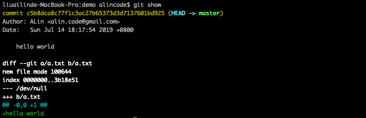

# git show 指令



### 常用指令範例

| 範例                                         | 說明                         |
|---------------------------------------------|------------------------------|
| git show                                    |                              |
| git show README.md                          | 查看 README.md 檔案的內容變動紀錄 |

```
🤔 `git log` 跟 `git show` 差在哪？
```
---
### 語法結構

```
usage: git log [<options>] [<revision-range>] [[--] <path>...]
   or: git show [<options>] <object>...

    -q, --quiet           suppress diff output
    --source              show source
    --use-mailmap         Use mail map file
    --decorate-refs <pattern>
                          only decorate refs that match <pattern>
    --decorate-refs-exclude <pattern>
                          do not decorate refs that match <pattern>
    --decorate[=...]      decorate options
    -L <n,m:file>         Process line range n,m in file, counting from 1
```