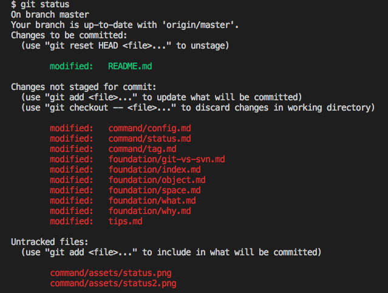

# git status 指令

### 使用情境

* 觀看檔案的狀態

### 狀態


```
$ git status

On branch master
nothing to commit, working tree clean
```

| 狀態階段                                | 中譯       |        說明                |
|----------------------------------------|-----------|---------------------------|
| Untracked files                        | 未追蹤     | 還未被追蹤的狀態             |
| Changes not staged for commit          | 已修改     | 有被更動但尚未要提交的檔案     |
| Changes to be committed                | 已暫存     | 將要提交的檔案             |
| nothing to commit, working tree clean  | 已提交     | 已提交的檔案及變動記錄        |

#### 工作區、暫存區、儲存庫


#### 區域

區塊名稱                |   中譯    | 說明                
----------------------|----------|--------------------
working directory     | 工作目錄   | 經過修改的檔案        
staging area / index  | 暫存區域   | 要提交的變動清單      
local repository      | 儲存庫     | 已提交的檔案及變動記錄 

### .gitignore

* 想忽略的檔案，如暫存檔、log、編譯後的檔案
* [A collection of .gitignore templates](https://github.com/github/gitignore)

如果被 ignore 考量進來，又可以在分為：

* 被追蹤：被加入 index 的檔案
* 還沒被追蹤：還沒被加入 index 的檔案
* 被忽略：被定義在忽略清單的檔案


<!-- 
**強制刪除那些已被設為忽略，不存在儲存庫，但還存在工作目錄的那些檔案。**

```sh
git clean -fx
```
-->

### 實際情況會接近，如下圖所示：



---
### 語法結構

```
usage: git status [<options>] [--] <pathspec>...

    -v, --verbose         be verbose
    -s, --short           show status concisely
    -b, --branch          show branch information
    --porcelain           machine-readable output
    --long                show status in long format (default)
    -z, --null            terminate entries with NUL
    -u, --untracked-files[=<mode>]
                          show untracked files, optional modes: all, normal, no. (Default: all)
    --ignored             show ignored files
    --ignore-submodules[=<when>]
                          ignore changes to submodules, optional when: all, dirty, untracked. (Default: all)
    --column[=<style>]    list untracked files in columns
```