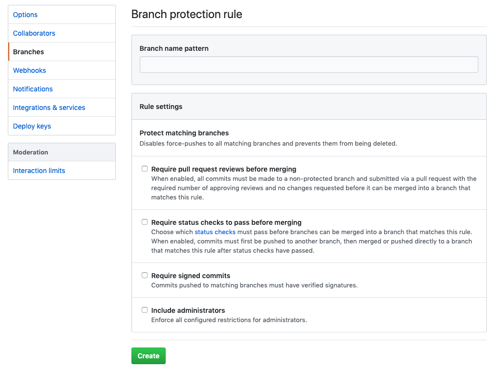

# Github

Git Server Hosting

<https://github.com/github/training-kit>

### Git 與 GitHub 的區別？

### watch 追蹤

* 會收到更變通知
  * 郵件
  * 快訊

### star 給一個星星

例如像 facebook 按「讚」

### Fork

fork 是發生在「整個容器」的階層上，branch 是發生在「單一容器」中。

### 啟動保護機制

切換到 Setting 下的 Branches 頁籤，點擊 add rule 按鈕

設定

