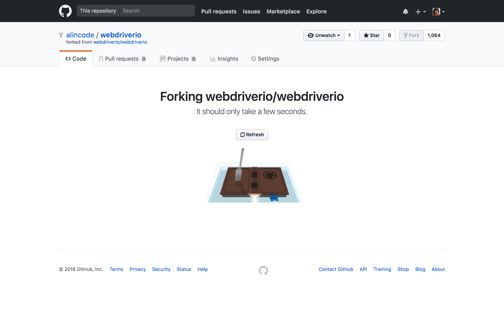
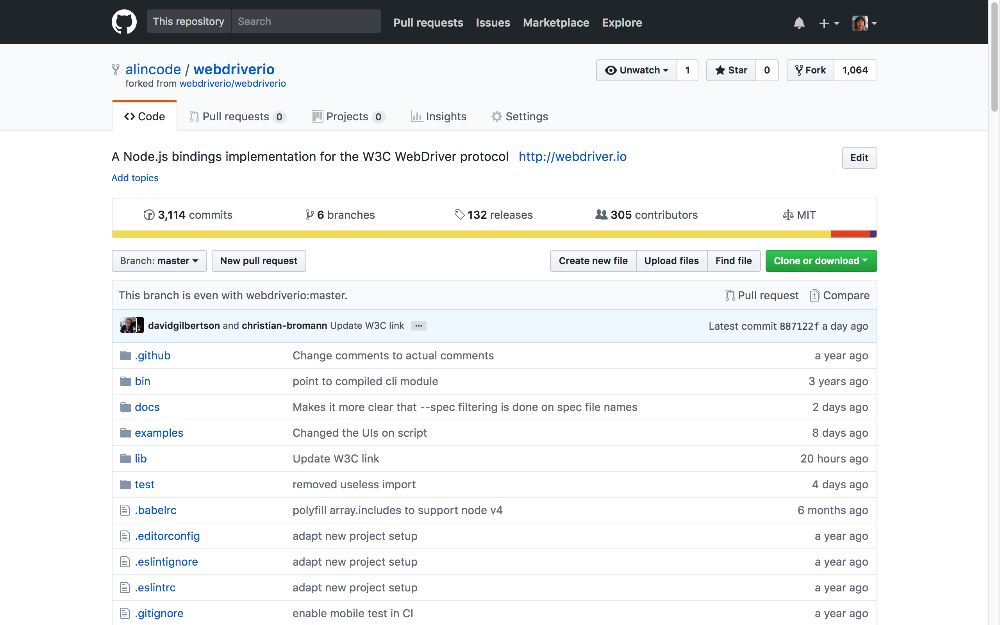
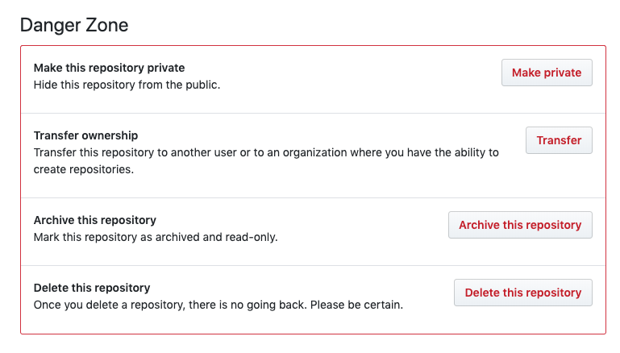

# Github Fork

<!-- fork 是發生在「整個儲存庫」的階層上，branch 是發生在「單一儲存庫」中。 -->

### 使用情境

* 常發生在長期無人維護的專案，但你需要使用並修改。
* 你需要用某個儲存庫當基底，開發出一條完全新的路線。

### 練習題：Fork 一個別人的儲存庫

```
<https://github.com/alincode/git-sandbox-for-iii>
```






### 練習題：當你不需要時，刪除它



<!-- 
`git remote -v`

```
origin  https://github.com/your-username/forked-repository.git (fetch)
origin  https://github.com/your-username/forked-repository.git (push)
upstream    https://github.com/original-owner-username/original-repository.git (fetch)
upstream    https://github.com/original-owner-username/original-repository.git (push)
```

```
git fetch upstream
git checkout master
git merge upstream/master
```
 -->
