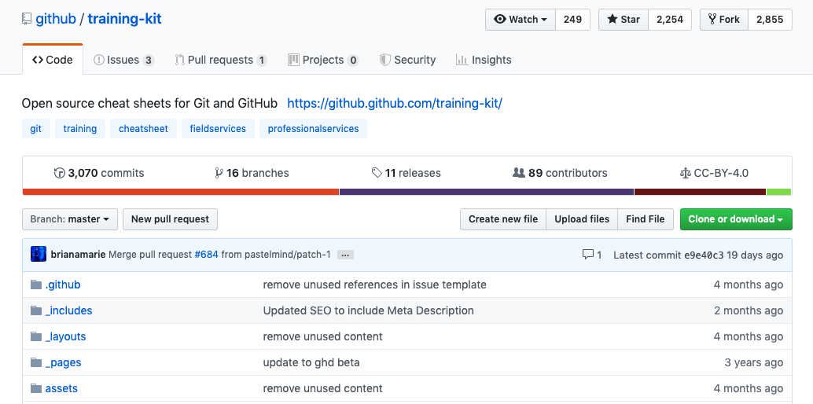

# Github 其他補充

<https://github.com/github/training-kit>

### watch 追蹤

* 會收到更變通知
  * 郵件
  * 快訊

### star 給一個星星

例如像 facebook 按「讚」

### 練習題：新增一個 ISSUE

[Closing issues using keywords](https://help.github.com/en/articles/closing-issues-using-keywords)

### 啟動保護機制

切換到 Setting 下的 Branches 頁籤，點擊 add rule 按鈕

設定

