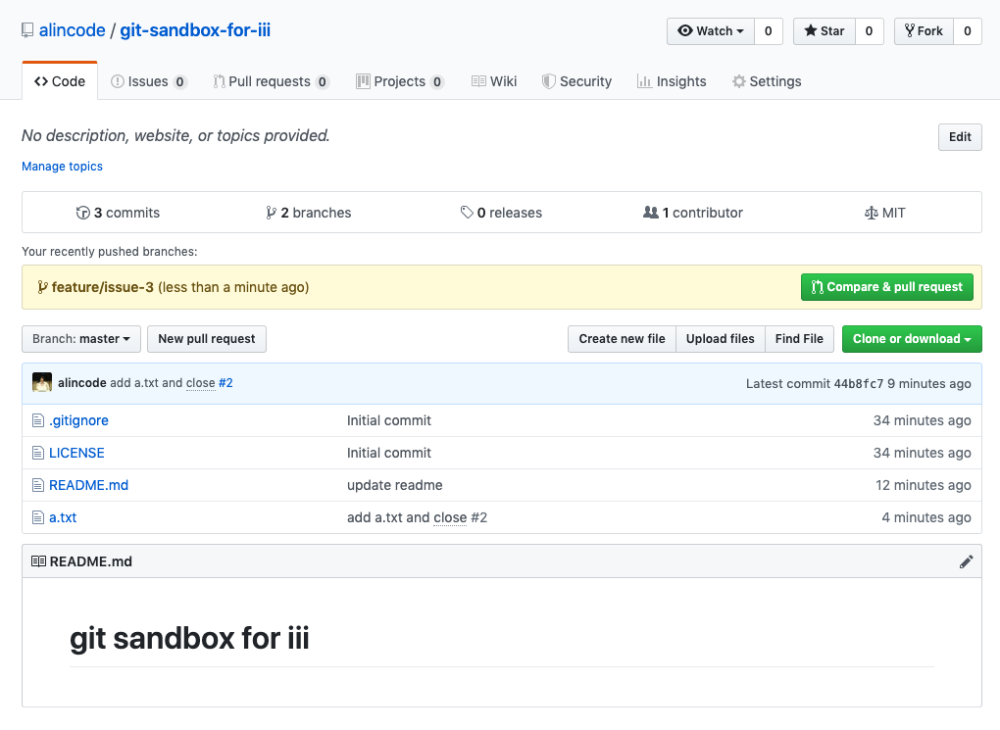
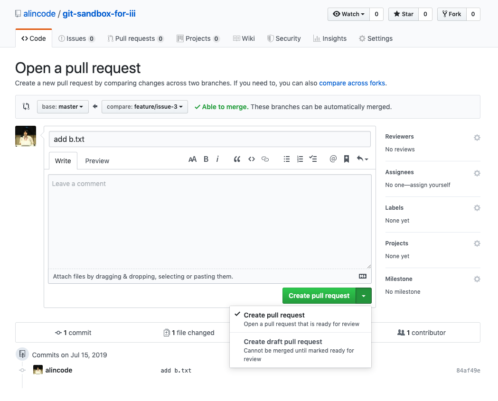
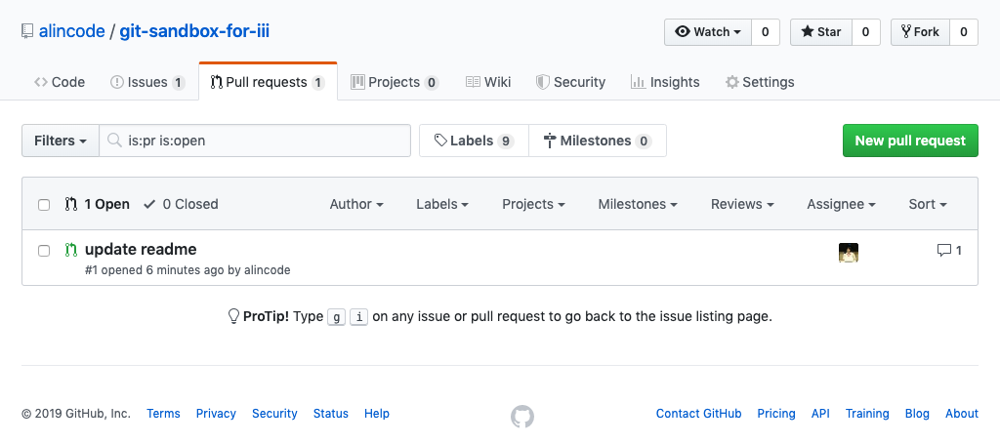
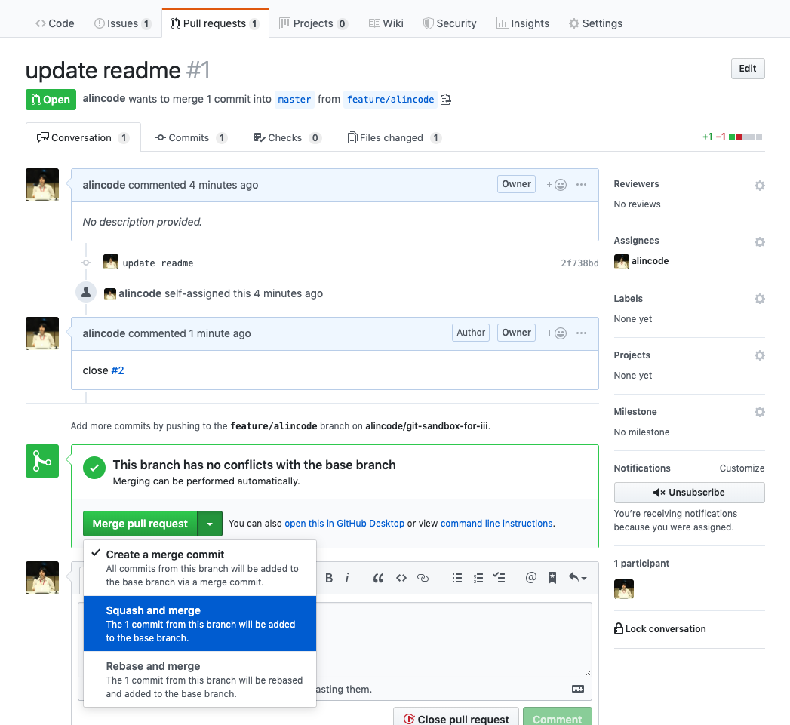

# Github Pull Request

PR 的全名是 Pull Request，它是一種通知機制，它可讓您在 GitHub 上向他人告知你已經將修改 push 到儲存庫中了，請求協作者對你的送交內容進行審查，希望他合併你的修改，這就是 `Pull Request`。

向 Github 託管的某一項目中的某一分支提出合併請求。項目管理者則可以在 github 的 web 界面上合併來自不同分支的代碼，解決合併衝突，做代碼審查或對代碼進行評論。

## 新增一個 PR

步驟：按一下「右方」綠色的 `compare & pull request` 的按鈕



步驟：按一下「下方」綠色的 `create pull request` 按鈕，接著你應該可以看到 PR 成功的訊息。或者你也可以從上方的 `Pull requests` 頁籤查看剛剛的那筆 PR 是否存在。



不知道你有沒有注意到 `create pull request` 按鈕旁還有一個下拉選單，按下去之後可以看到 `create draft pull request` 的選項。如果你你想發出一個 PR 讓協作者審查，但更動的部分其實還沒有完成，這種 PR 可以避免對方不小心按了 merge 的按鈕。

**注意**

發 PR 不代表一定要使用 `Fork` 功能，會用 Fork 功能主要是因為你沒有在那個原生 repo 沒有送交的權限，所以你可以 Fork repo 回來後，你才會有足夠的權限可以發布送交紀錄到遠端 repo。

## 查看 PR



## 合併 PR



## 練習題

### 情境：發一個 Pull Rquest (PR)

```
git checkout master
git branch feature-3
git checkout feature-3
```

```
git add .
git commit -m 'implement feature 3'
git push -u origin feature-3
```

接著就可以遵循前面提到的 `新增一個 PR` 的圖一跟圖二的步驟。

### 情境：進行代碼審查 Code Review

1. 前往 `Pull requests` 頁籤查看所有的 PR 列表
1. 選擇你要查看的 PR，然後點進去看更多的資訊
1. 檢視程式碼變更紀錄，針對有疑問的修正紀錄提出問題或建議修改方向。

## 延伸閱讀

- [Creating a pull request](https://help.github.com/en/articles/creating-a-pull-request)
