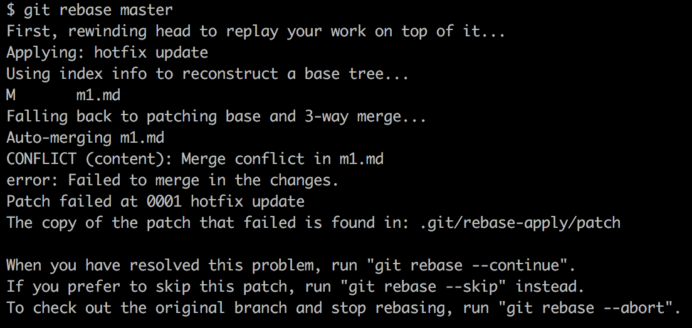
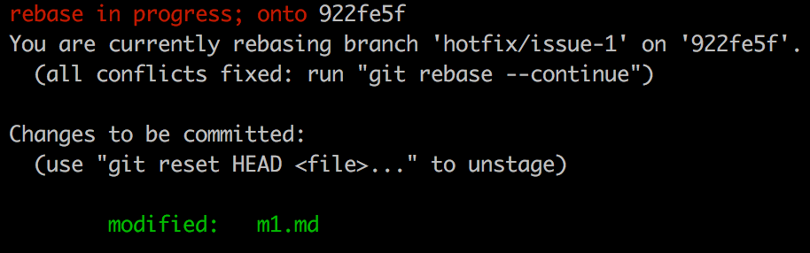
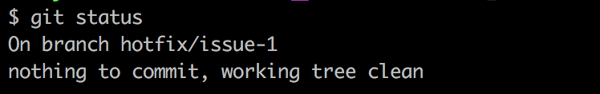

### 解 rebase 衝突

#### Step1：建立衝突情境

```
git clone https://github.com/alincode/git-rebase-conflict-sandbox.git
cd git-rebase-conflict-sandbox
git remote rm origin
```
<!-- 
```
echo "Hello World" >> README.md && git add . && git commit -m 'init'
echo "1" >> m1.md && git add . && git commit -m 'm1'
git checkout -b hotfix/issue-1
```
-->

<!-- 
#### Step2：hotfix/issue-1 分支 commit 了一些東西

```
# 在文字 1 後面加一個 2
vi m1.md
```

```
git add . && git commit -m 'h1'
git checkout master
```

#### Step3：master 分支也 commit 了一些東西

```
# 在文字 1 後面加一個 3
vi m1.md
```

```
git add . && git commit -m 'm2'
``` 
-->

#### Step2：發生衝突

```
# 切換到 hotfix/issue-1 分支
git checkout hotfix/issue-1

# 將 hotfix/issue-1 內新增的第一筆 commit，接在 master 分支的最後一筆 commit。
git rebase master
```



#### Step3：查看衝突



```
# 查看衝突
git status
git diff

# 編修衝突
vi m1.md
```

#### Step4：解衝突

```
# 再一次確認編修結果
git diff

# 將修改的內容，放入 index 中
git add .

# 告訴 rebase 我解完了
git rebase --continue
```

#### Step7

不一定解一次，就解掉了，如果 hotfix/issue-1 分支，跟 master 分支的送交紀錄差距很遠，可能會連續碰到好幾次衝突，你得一直會到 Step5 的階段，在解一次新的衝突，直到用 `git status` 指令觀察，確定 `rebase in progress; onto`不見了。



若如果你在過程中會連續遇到五次衝突，但你在解第四次衝突的時候，忽然想起剛剛解第二次衝突的時候，內容有改錯，這時候你就得用 `git rebase --abort` 指令，把之前所有修改衝突的狀態都 reject 掉，重新再做一次 `git rebase master`。

如果你沒有照這個正常步驟走完，例如不管 git 的提示，遇到衝突一直按 `git rebase --skip` 忽略它。最後會導致 git 回報你 rebase 成功，但實際結果卻是遺失了一堆的 commit 記錄。

例如你明明沒解完，卻用 `git add . && git rebase --continue` 告訴 git 你解完了，git 並沒有機制防止你犯這樣的錯，最後將會導致，一堆衝突沒解完，當成一般正常內容 commit 進了儲存庫中了。