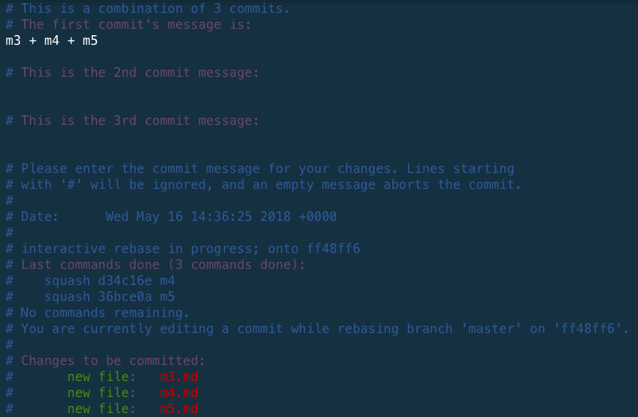
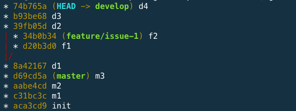
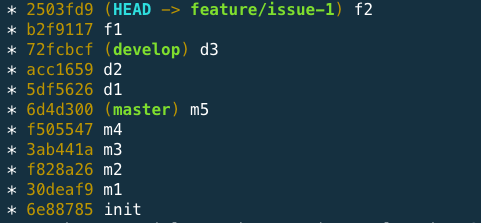
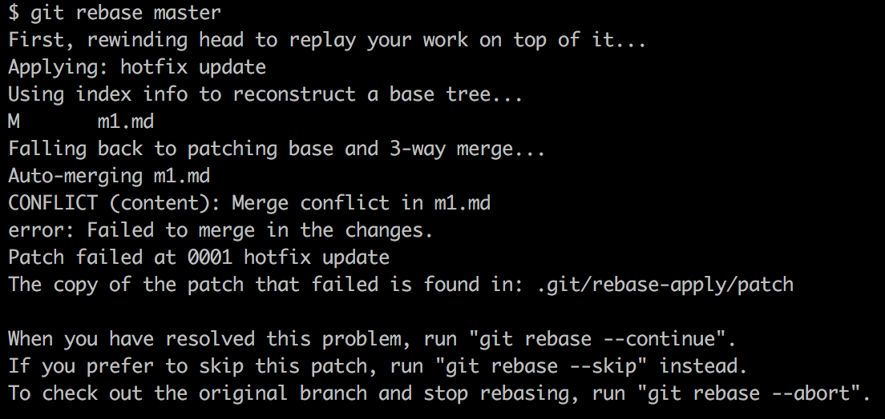

# rebase 練習題

<!-- 開一個新的 repo 不要共用 -->

### 1. 情境：重新指定送交的基礎位置

#### Step1

```
sh start1.sh

echo "Hello World" >> README.md && git add . && git commit -m 'init'
echo "1" >> m1.md && git add . && git commit -m 'm1'
echo "2" >> m2.md && git add . && git commit -m 'm2'

git checkout -b develop
echo "1" >> d1.md && git add . && git commit -m 'd1'
echo "2" >> d2.md && git add . && git commit -m 'd2'

git checkout master
echo "3" >> m3.md && git add . && git commit -m 'm3'

sh start.sh
```


#### Step2

```
git checkout develop
git rebase master
```


#### Step3

```
git checkout master
git merge develop
```


### 2. 情境：合併 commit

#### Step1

```
vi start2.sh

echo "Hello World" >> README.md && git add . && git commit -m 'init'
echo "1" >> m1.md && git add . && git commit -m 'm1'
echo "2" >> m2.md && git add . && git commit -m 'm2'
echo "3" >> m3.md && git add . && git commit -m 'm3'
echo "4" >> m4.md && git add . && git commit -m 'm4'
echo "5" >> m5.md && git add . && git commit -m 'm5'

sh start2.sh
```



#### Step2

```
git rebase -i HEAD~3
// or
git rebase -i 124519e
```



#### Step3



#### Step4



#### Step5





### 3. 情境：指定要從哪裡開始

#### Step1

```
vi start3.sh

echo "Hello World" >> README.md && git add . && git commit -m 'init'
echo "1" >> m1.md && git add . && git commit -m 'm1'
echo "2" >> m2.md && git add . && git commit -m 'm2'
echo "3" >> m3.md && git add . && git commit -m 'm3'
git checkout -b develop
echo "1" >> d1.md && git add . && git commit -m 'd1'
git checkout -b feature/issue-1
echo "1" >> f1.md && git add . && git commit -m 'f1'
echo "2" >> f2.md && git add . && git commit -m 'f2'
git checkout develop
echo "2" >> d2.md && git add . && git commit -m 'd2'
echo "3" >> d3.md && git add . && git commit -m 'd3'
echo "4" >> d4.md && git add . && git commit -m 'd4'

sh start3.sh
```



#### Step2

```
git checkout feature/issue-1
git rebase --onto b93be68 8a42167
```


#### Step3

```
git rebase develop
```


### 4. 情境：兩個分支交疊在一起

* feature/issue-1 是從 develop 開出的分支
* develop 是從 master 開出的分支

#### Step1

```
vi start4.sh

echo "Hello World" >> README.md && git add . && git commit -m 'init'
echo "1" >> m1.md && git add . && git commit -m 'm1'
echo "2" >> m2.md && git add . && git commit -m 'm2'
echo "3" >> m3.md && git add . && git commit -m 'm3'
git checkout -b develop
echo "1" >> d1.md && git add . && git commit -m 'd1'
echo "2" >> d2.md && git add . && git commit -m 'd2'
git checkout -b feature/issue-1
echo "1" >> f1.md && git add . && git commit -m 'f1'
echo "2" >> f2.md && git add . && git commit -m 'f2'
git checkout develop
echo "3" >> d3.md && git add . && git commit -m 'd3'
git checkout master
echo "4" >> m4.md && git add . && git commit -m 'm4'
echo "5" >> m5.md && git add . && git commit -m 'm5'

sh start4.sh
```


#### Step2

```
git checkout develop
git rebase master
```


#### Step3

```
git checkout feature/issue-1
git rebase develop
```



### 5. 情境：悲劇現場

#### Step1

* init 有 1 個
* m 有 3 個
* d 有 4 個
* f 有 2 個

```
vi start5.sh

echo "Hello World" >> README.md && git add . && git commit -m 'init'
echo "1" >> m1.md && git add . && git commit -m 'm1'
echo "2" >> m2.md && git add . && git commit -m 'm2'
echo "3" >> m3.md && git add . && git commit -m 'm3'
git checkout -b develop
echo "1" >> d1.md && git add . && git commit -m 'd1'
git checkout -b feature/issue-1
echo "1" >> f1.md && git add . && git commit -m 'f1'
echo "2" >> f2.md && git add . && git commit -m 'f2'
git checkout develop
echo "2" >> d2.md && git add . && git commit -m 'd2'
echo "3" >> d3.md && git add . && git commit -m 'd3'
echo "4" >> d4.md && git add . && git commit -m 'd4'

sh start5.sh
```


#### Step2：參數位置弄顛倒了

```
git rebase --onto 6b193ca bac0cfe
```


### 6. 解 rebase 衝突

#### Step1

```
echo "Hello World" >> README.md && git add . && git commit -m 'init'
echo "1" >> m1.md && git add . && git commit -m 'm1'
git checkout -b hotfix/issue-1
```

#### Step2：hotfix/issue-1 分支 commit 了一些東西

```
# 在文字 1 後面加一個 2
vi m1.md
```

```
git add . && git commit -m 'h1'
git checkout master
```

#### Step3：master 分支也 commit 了一些東西

```
# 在文字 1 後面加一個 3
vi m1.md
```

```
git add . && git commit -m 'm2'
```

#### Step4

```
# 切換到 hotfix/issue-1 分支
git checkout hotfix/issue-1

# 將 hotfix/issue-1 內新增的第一筆 commit，接在 master 分支的最後一筆 commit。
git rebase master
```



#### Step5：


```
# 查看衝突
git status
git diff

# 編修衝突
vi m1.md
```

#### Step6

```
# 再一次確認編修結果
git diff

# 將修改的內容，放入 index 中
git add .

# 告訴 rebase 我解完了
git rebase --continue
```

#### Step7

不一定解一次，就解掉了，如果 hotfix/issue-1 分支，跟 master 分支的送交紀錄差距很遠，可能會連續碰到好幾次衝突，你得一直會到 Step5 的階段，在解一次新的衝突，直到用 `git status` 指令觀察，確定 `rebase in progress; onto`不見了。


若如果你在過程中會連續遇到五次衝突，但你在解第四次衝突的時候，忽然想起剛剛解第二次衝突的時候，內容有改錯，這時候你就得用 `git rebase --abort` 指令，把之前所有修改衝突的狀態都 reject 掉，重新再做一次 `git rebase master`。

如果你沒有照這個正常步驟走完，例如不管 git 的提示，遇到衝突一直按 `git rebase --skip` 忽略它。最後會導致 git 回報你 rebase 成功，但實際結果卻是遺失了一堆的 commit 記錄。

例如你明明沒解完，卻用 `git add . && git rebase --continue` 告訴 git 你解完了，git 並沒有機制防止你犯這樣的錯，最後將會導致，一堆衝突沒解完，當成一般正常內容 commit 進了 repo 中。