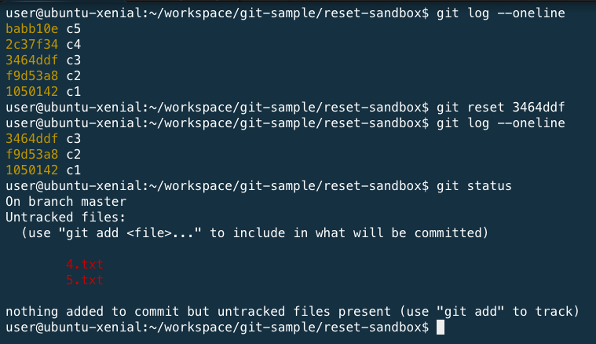
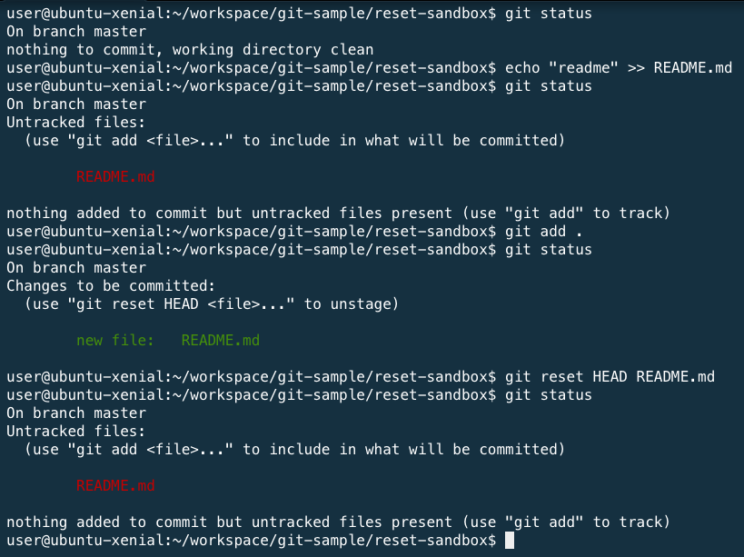

# 練習題：reset

### 情境：重新 commit

1. 新增五個 commit 紀錄
2. 透過 `git reset 3464ddf` 指令，還原到過去狀態，重新 commit

### 情境：將新增並已加入索引的檔案，還原到沒加入索引之前

1. 編輯 README.md
1. 透過 `git add README.md` 指令，將修改的內容加入索引。
1. 透過 `git status` 指令，查看目前檔案狀態。
1. 透過 `git reset HEAD README.md` 指令，將檔案變成 Unstaged (移除索引)。
