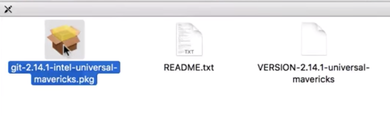

# 在 Mac 作業系統上安裝 Git

#### 方法一：透過 Brew 來安裝 Git

[Brew 官網](https://brew.sh/index_zh-tw)

```sh
# 安裝 Brew
/usr/bin/ruby -e "$(curl -fsSL https://raw.githubusercontent.com/Homebrew/install/master/install)"

# 使用 Homebrew 來安裝 Git
brew install git

# 確認 Git 安裝完成
git --version
```

#### 方法二：官方

* 官方網站下載 Git：<https://git-scm.com/download/mac>


