# 在 Window 作業系統上安裝 Git

### 查看作業系統版本

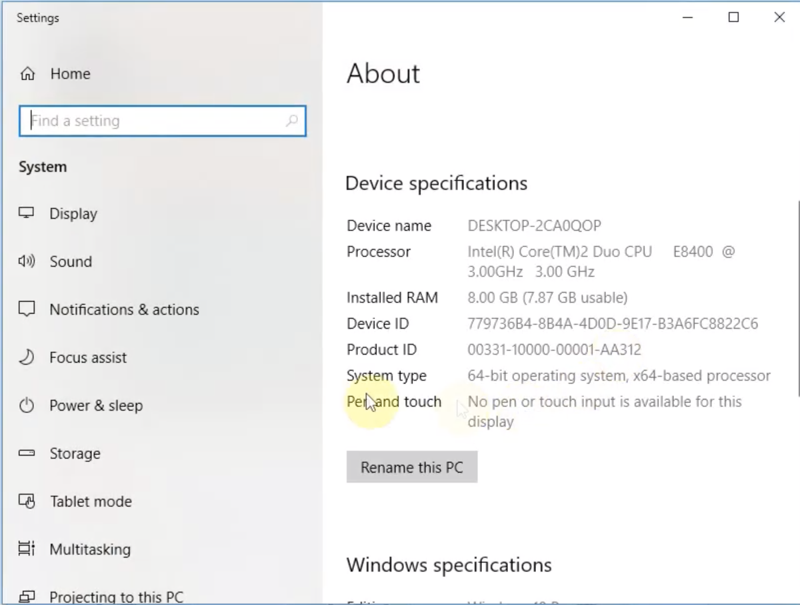

### 下載安裝檔

<https://git-scm.com/download/win>

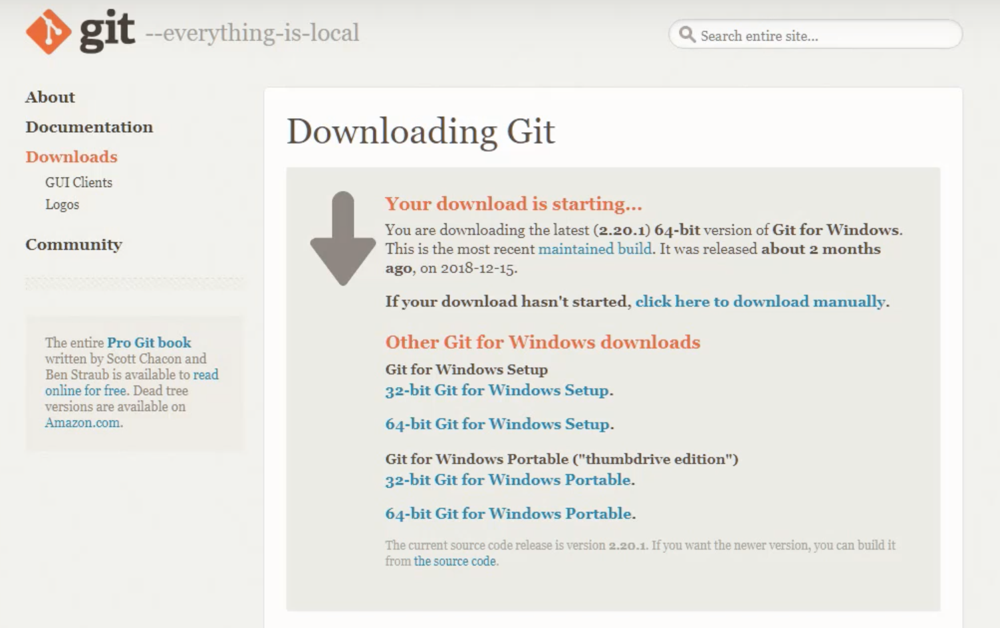

### 安裝步驟

**版權宣告**

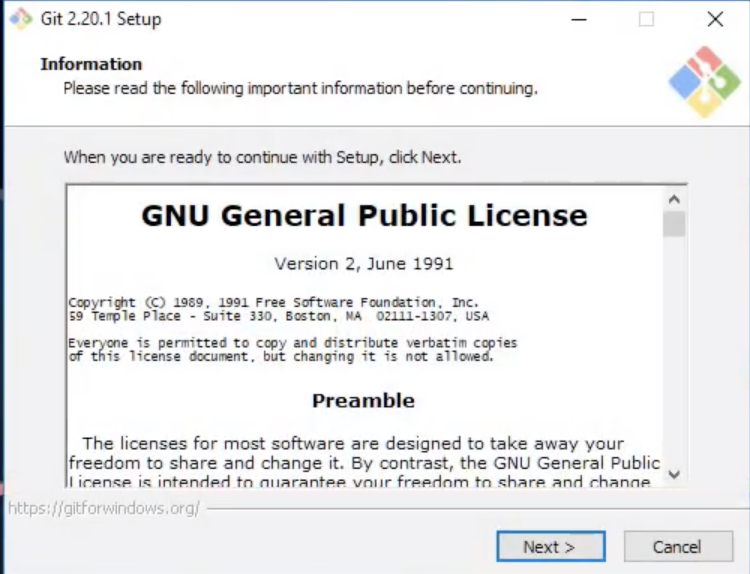

**想安裝的 Components**

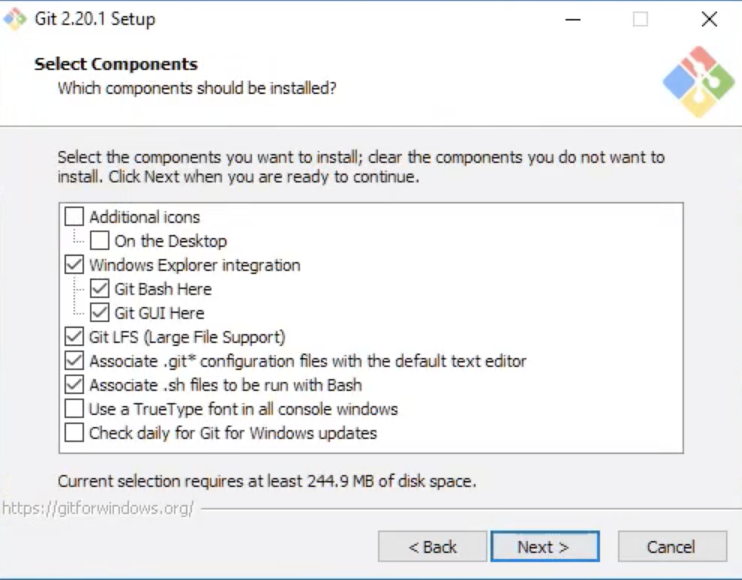

**選擇安裝路徑**

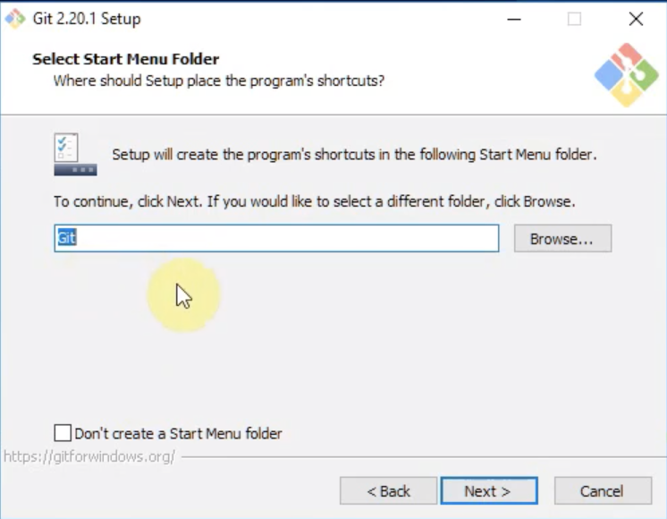

**選擇預設的編輯器**

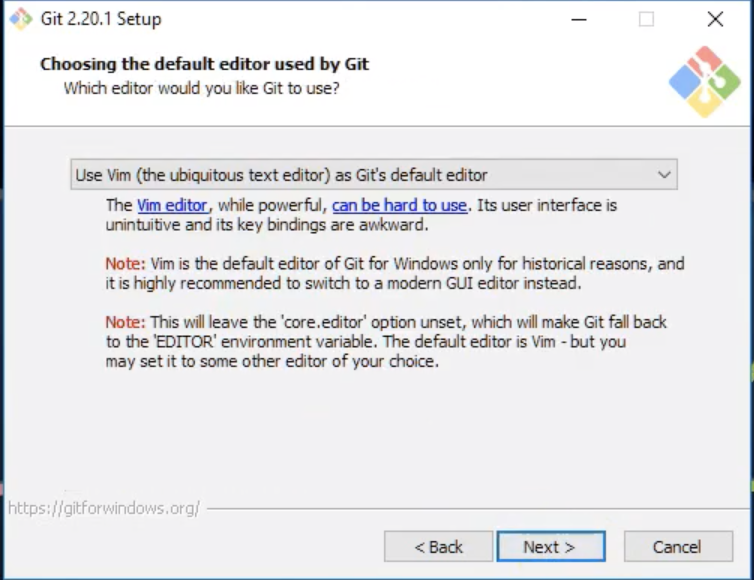

**調整你的 PATH 環境變數**

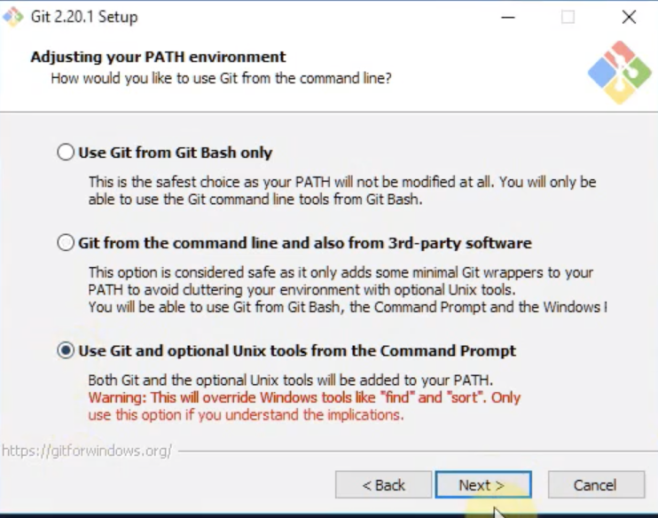

**選擇模組**

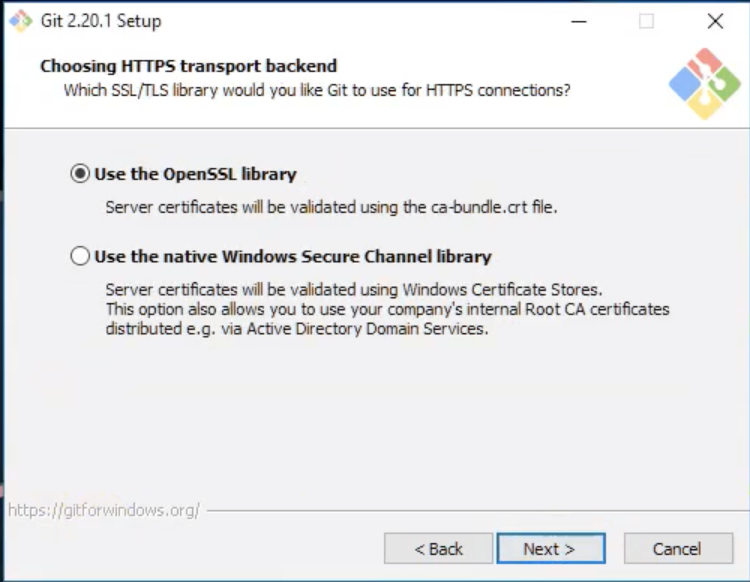

**換行設定**

第一項如果勾選的話會在 checkout ( 切換 commit ) 的時候，自動將斷行符號由 LF ( linux ) 轉成 CRLF ( windows )，如果是在 linux 的系統上安裝則相反，選擇這個的好處是在進行協同開發的時候如果使用的系統不相同，就比較不會因為斷行符號的不同而發生錯誤。第二項則是預先設置一個通用的 ignore，這兩項可以依照自己的需求選擇。

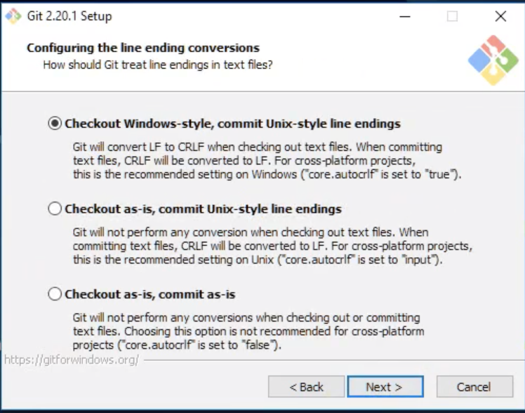

**額外的設定**

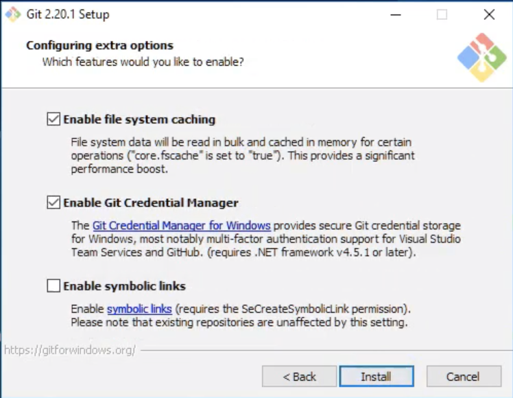

**安裝完成**

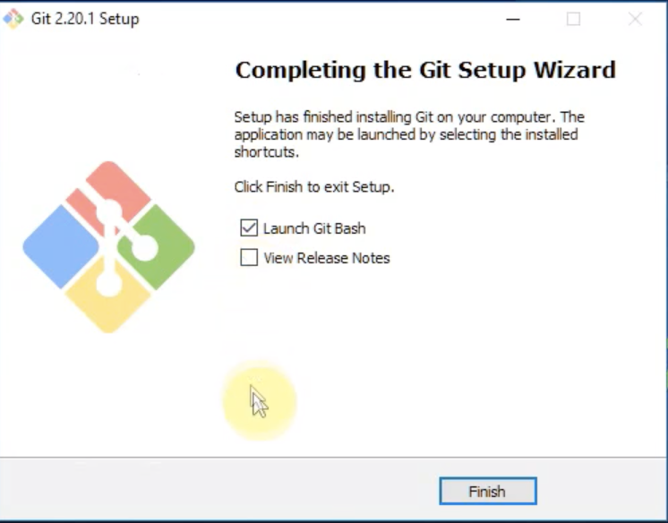